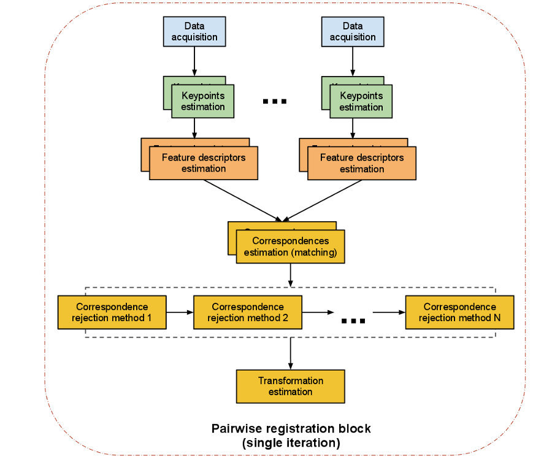

PCL完全是一个模块化的现代C++模板库，基于一下第三方库：Boost,Eigen,FLANN,VTK,CUDA,OpenNI,Qhull，实现点云的获取，滤波，分割，配准，检索，特征提取，识别，追踪，曲面重建，可视化等。


## 可用Point类型

```shell
PointXYZ
PointXYZI
PointXYZRGBA
PointXYZRGB
PointXY
InterestPoint
Normal
PointNormal
PointXYZRGBNormal
PointXYZINormal
PointWithRange
PointWithViewpoint
MomentInvariants
PrincipalRadiiRSD
Boundary
PrincipalCurvatures
BounPFHSignature125dary
FPFHSignature33
VFHSignature308
Narf36
BorderDescription
IntensityGradient
Histogram
PointWithScale
PointSurfel
```

# 01common

# 02KDTree

# 03Octree

# 04Search

# 05sample consensus采样一致性

# 06range-image深度图像

# 07 tracking跟踪

# 08 数据输入输出

# 09 filters滤波/降采样

# 10 features特征

# 11 surface表面

# 12 segmentation分割(聚类)

# 13 recognition识别

# 14 registration配准




# 15 visualization可视化

# 16 keypins关键点

# 17 tracking